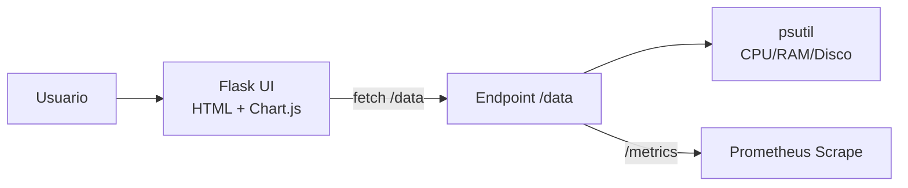

# 🖥️ Realtime System Monitor — Flask + Chart.js + Prometheus

> App web **ligera** para visualizar en **tiempo real** CPU, RAM y Disco. Construida con **Python (Flask)**, **Chart.js** y **psutil**. Ideal para **demos de observabilidad**, prácticas **full‑stack** y **portafolios** (Cloud/DevOps/SysOps).

<p align="left">
  
  
  
  
</p>

---

## ✨ Características

* ⚡ **Backend Flask**: servidor ligero y rápido
* 📈 **Chart.js**: gráficos dinámicos actualizados **cada 2s** (configurable)
* 🔎 **Datos en vivo**: CPU, RAM y Disco vía **psutil**
* 🌐 **API REST** lista:

  * `GET /data` → métricas en **JSON**
  * `GET /metrics` → exposición **Prometheus**
* 🖥️ **Dashboard responsive** y simple
* 🛠️ **Despliegue fácil**: local, Codespaces o contenedores
* 📦 **Código minimalista** en un archivo `app.py`

---

## 🧭 Arquitectura (visión rápida)



---

## 📂 Estructura

```
realtime-system-monitor/
├── app.py            # Flask + Chart.js + psutil
├── requirements.txt  # Dependencias
└── README.md         # Documentación
```

---

## ⚙️ Instalación y ejecución

### Opción 1 — Local (Python 3.9+)

```bash
# 1) Clonar
git clone https://github.com/tuusuario/realtime-system-monitor.git
cd realtime-system-monitor

# 2) Instalar deps
pip install -r requirements.txt
# o mínimo: pip install flask psutil

# 3) Ejecutar
python app.py
```

**Accede:**

* 📊 Dashboard → [http://localhost:5000](http://localhost:5000)
* 📡 Prometheus → [http://localhost:5000/metrics](http://localhost:5000/metrics)

### Opción 2 — GitHub Codespaces

```bash
pip install -r requirements.txt
python app.py
```

Luego **Open in Browser**.

### Opción 3 — Docker (opcional)

**Dockerfile sugerido**

```dockerfile
FROM python:3.11-slim
WORKDIR /app
COPY requirements.txt ./
RUN pip install --no-cache-dir -r requirements.txt
COPY . .
ENV PORT=5000 SAMPLE_INTERVAL=2.0
EXPOSE 5000
CMD ["python","app.py"]
```

```bash
docker build -t realtime-sysmon .
docker run --rm -p 5000:5000 realtime-sysmon
```

---

## 🌐 API Endpoints

| Endpoint   | Método | Descripción                         |
| ---------- | ------ | ----------------------------------- |
| `/`        | GET    | Dashboard HTML con gráficos en vivo |
| `/data`    | GET    | Métricas **JSON** (CPU, RAM, Disco) |
| `/metrics` | GET    | **Prometheus exposition**           |

**Ejemplos**

```bash
curl -s http://localhost:5000/data | jq .
# {
#   "cpu": 23.4,
#   "ram": 41.8,
#   "disk": 67.2,
#   "ts": 1724630000
# }

curl -s http://localhost:5000/metrics | head
```

---

## 🔧 Configuración

Puedes usar variables de entorno (o adaptarlas en `app.py`):

| Variable            | Descripción                  | Default           |
| ------------------- | ---------------------------- | ----------------- |
| `PORT`              | Puerto HTTP                  | `5000`            |
| `SAMPLE_INTERVAL`   | Intervalo de muestreo (seg.) | `2.0`             |
| `ENABLE_PROMETHEUS` | Habilitar `/metrics` (0/1)   | `1`               |
| `METRICS_NAMESPACE` | Prefijo de métricas          | `realtime_sysmon` |

> Para producción, expón `/metrics` sólo a redes internas o protégelo tras un proxy.

---

## 📈 Integración con Prometheus (ejemplo)

`prometheus.yml`:

```yaml
scrape_configs:
  - job_name: 'realtime-sysmon'
    static_configs:
      - targets: ['host.docker.internal:5000']  # Docker Desktop
      # - targets: ['realtime-sysmon:5000']     # docker-compose
```

**Tip Grafana**: crea paneles para `cpu`, `ram`, `disk` y tasa de actualización de `/data`.

---

## 🔒 Seguridad (básicos)

* No expongas `/metrics` a Internet sin control.
* Considera **Basic Auth** o IP allowlist en el reverse proxy.
* Sirve la UI sobre **HTTPS** detrás de un proxy (Nginx/Caddy) si lo publicas.

---

## 🧯 Troubleshooting

* **Página no carga** → verifica `PORT` libre y dependencias instaladas.
* **Métricas vacías** → confirma que `psutil` está instalado y accesible.
* **Charts lentos** → sube `SAMPLE_INTERVAL` (p. ej., a `3.0` seg).

---

## 🗺️ Roadmap

* [ ] Autenticación (token o Basic Auth) para dashboard
* [ ] Alertas por Slack/Email según umbrales
* [ ] Empaquetado Docker + `docker-compose.yml`
* [ ] Persistencia e integración Prometheus/Grafana
* [ ] Pruebas automáticas y GitHub Actions

---

## 📜 Licencia

**MIT** — Eres libre de usar, modificar y distribuir citando la fuente.

---

## 👨‍💻 Autor

**© 2025 Emanuel** — Licencia **MIT**
**LinkedIn:** [https://www.linkedin.com/in/emanuel-gonzalez-michea/](https://www.linkedin.com/in/emanuel-gonzalez-michea/)

